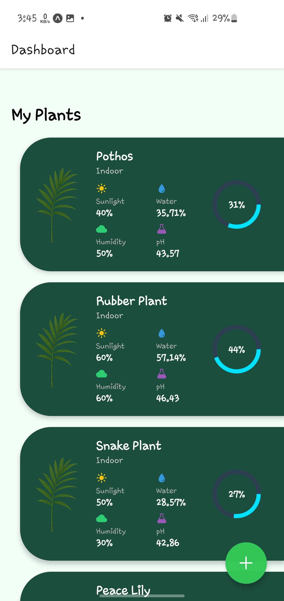
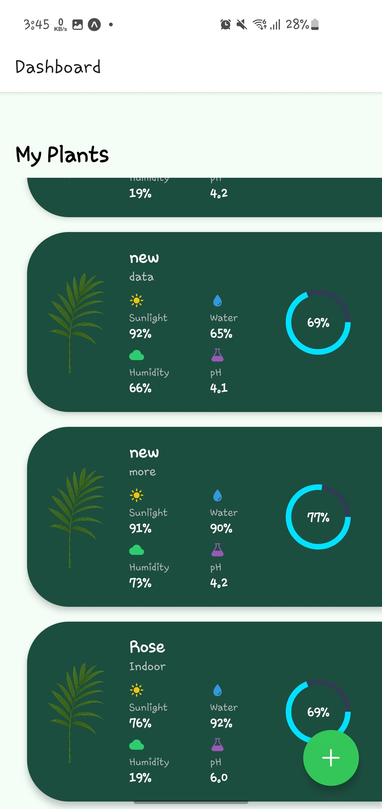
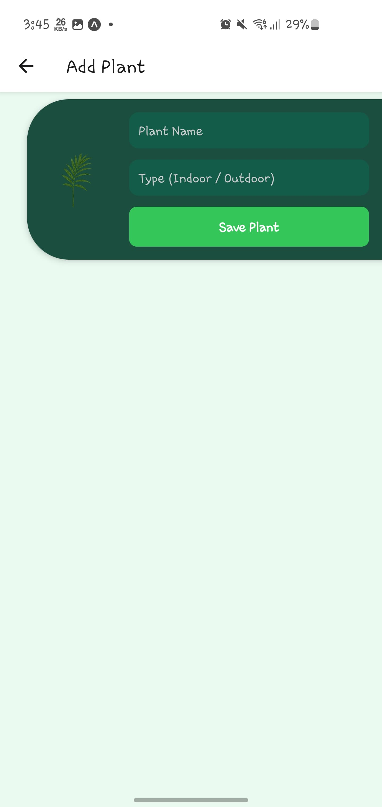
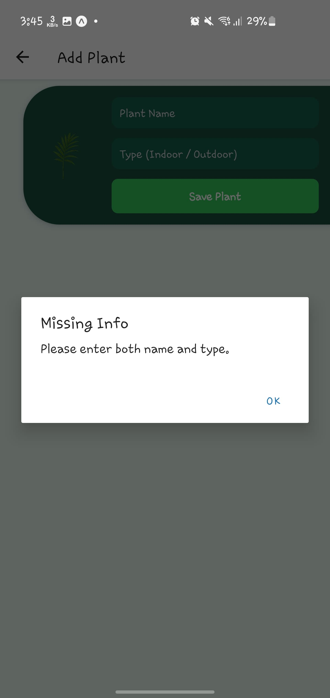

# Plant Monitoring App

This is a simple plant monitoring app built using React Native and Expo. It allows you to view a list of plants with details like sunlight, humidity, pH, and water levels. You can also add new plants to the list.

## Setup Instructions

1. Clone the repository:
   ```
   git clone https://github.com/Engr-Hamza-Saghir/PlantApp.git
   cd plant-monitoring-app
   ```

2. Install dependencies:
   ```
   npm install
   ```

3. Start the Expo development server:
   ```
   npx expo start
   ```
4. Run the app:
   - On mobile: Install **Expo Go** from the Play Store (I ran it on Samsung S10)
   - Scan the QR code shown in the terminal to open the app
   - For web git W on terminal

## Project Structure

```
plant-monitoring-app/

=> components/
      => PlantCard.js
=> screens/
      => DashboardScreen.js
      => AddPlantScreen.js
=> navigation/
      => StackNavigator.js
=> utils/
      => mockData.js
=> assets/
      => plants/ (local images i used )
      => screenshots/ (for screenshots of dashboard and add plant screen)
=> App.js
=> package.json
=> README.md
```

## Mock API

GET and POST operations are handled through [mockapi.io](https://mockapi.io/projects/688875bdadf0e59551ba0845). Vitals like sunlight, pH, etc. are generated randomly using JavaScript, Only plant name and type are getting by user and then submitted all data through POST.

## Component Structure

- **PlantCard**: Reusable component to display each plant.
- **DashboardScreen**: Main screen to view plant cards.
- **AddPlantScreen**: A screen to add a new plant.
- **StackNavigator**: Manages screen navigation.

## Features

- View list of plants, will get only data without picture, added picture after getting by using .Map and then display.
- Add new plant with name and type by user itself.
- Randomly generated data for pH, water, humidity, sunlight (creating them by using Math.random()).
- Works on both Android and Web via Expo
- Plant image applied manually on each fetch

## UI idea by
```
https://ca.pinterest.com/pin/118501033935775513
```


## Screenshots

### Dashboard




### Add Plant



